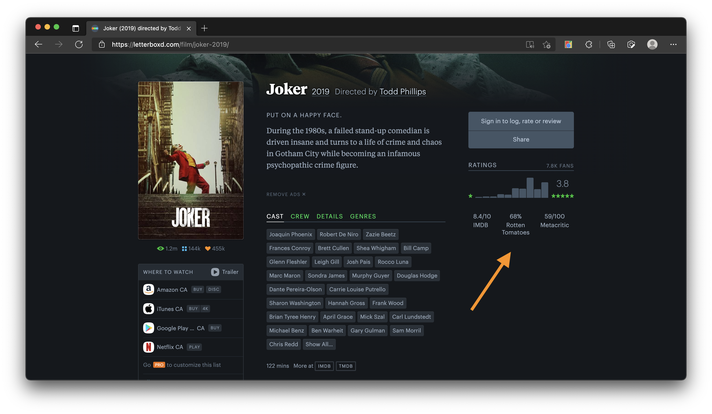
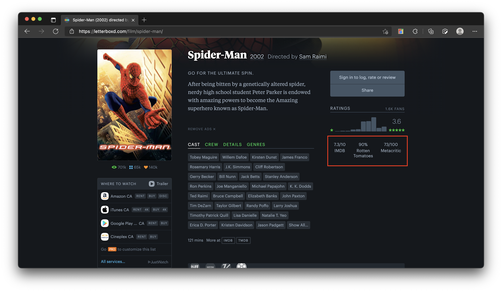

# More-Ratings-on-Letterboxd

### Description

Get IMDB, Rotten Tomatoes, and Metacritic ratings on Letterboxd! This project is a chrome extension that fetches and injects ratings from IMDB, Rotten Tomatoes, and Metacritic to [Letterboxd](https://letterboxd.com/). When installed, users will be able to see IMDB, Rotten Tomatoes, and Metacritic ratings on each film, right below Letterboxd's ratings:



### Getting Started:

#### Pre-requisites:

- Yarn
- Chromium browser (ex: Google Chrome, Edge)

#### Installation:

1. Clone this repository by running `git clone git@github.com:EKarton/More-Ratings-on-Letterboxd.git`

2. Install dependencies by running `yarn install`

3. Create a `.secrets.js` file on the root folder of this project with this structure:

   ```[js]
   export default {
     omdbApiKey: '<OMDB_API_KEY>',
   };
   ```

   where:

   - `OMDB_API_KEY` is your OMDB Api key. You can get a free one by filling out a form [here](https://www.omdbapi.com/apikey.aspx)

4. Build the chrome extension by running `yarn build`

5. Load your chrome extension on your web browser

   1. If you are using [Edge](https://www.microsoft.com/en-us/edge), follow this [guide](docs/GettingStartedOnEdge.md)
   2. If you are using [Chrome](https://www.google.ca/chrome/), follow this [guide](docs/GettingStartedOnChrome.md)

6. Once you have loaded your chrome extension, go to https://letterboxd.com/film/spider-man/. It should show the ratings on the bottom of the page:
   
