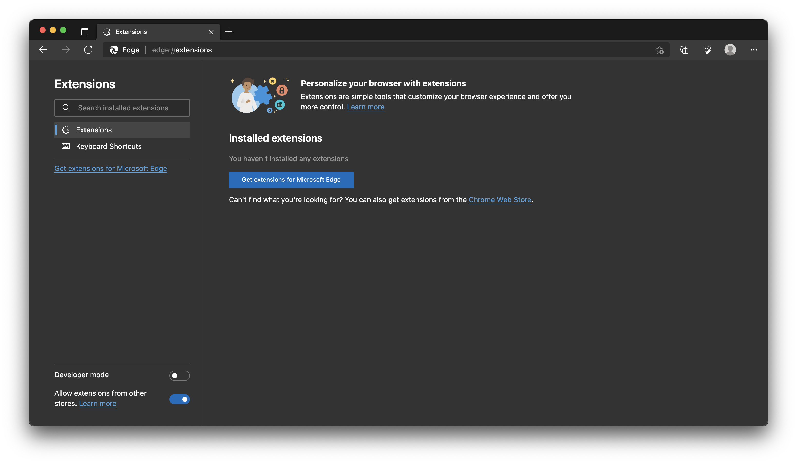
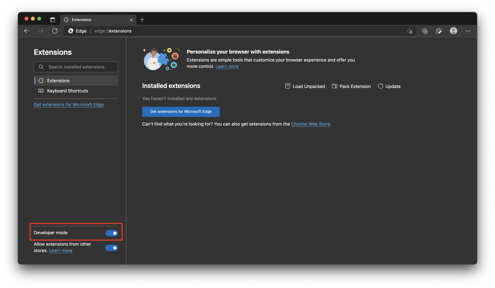
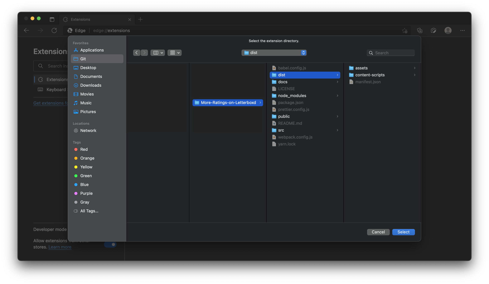
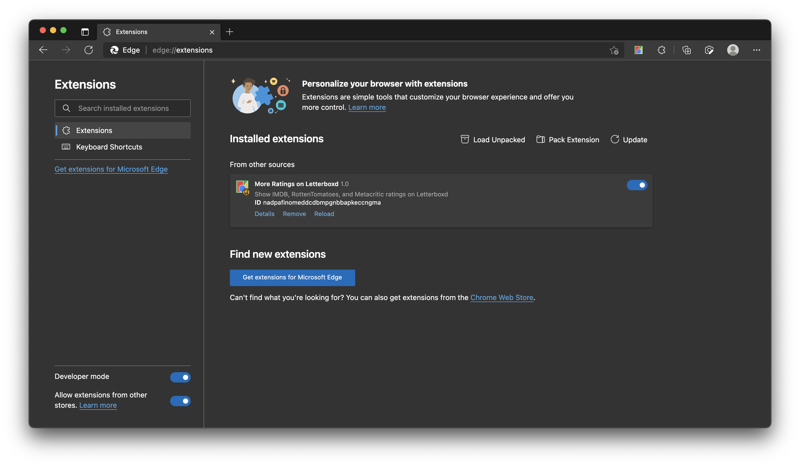

### Loading your chrome extension on Edge

1. On your browser, go to your extensions settings (on Chrome, it is [chrome://extensions](chrome://extensions) and on Edge, it is [edge://extensions](edge://extensions)):

   

2. Turn on `developer mode`:

   

3. Click on `Load Unpacked` button, and select this project's `dist` folder:

   

4. You should now see this extension in your extensions' page:

   

5. You have successfully loaded your chrome extension on edge! Go back to the [README.md](../README.md) file to continue your installation.
